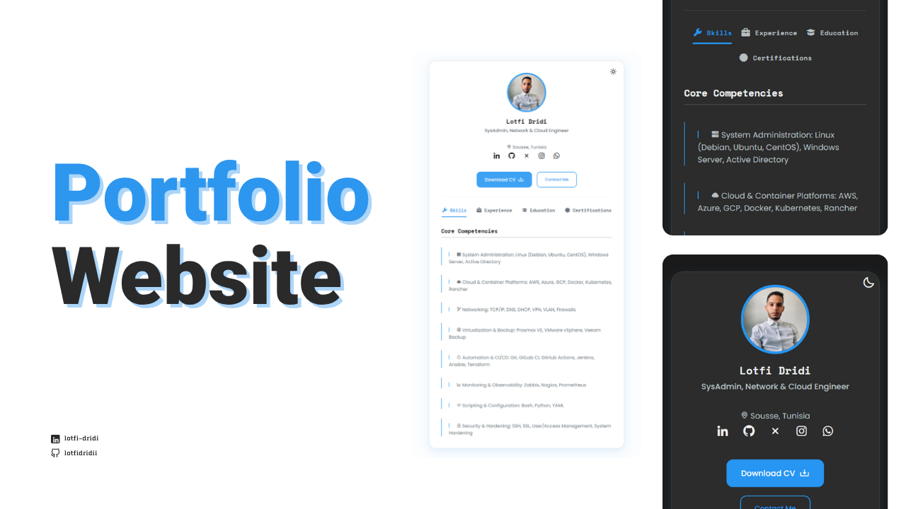

# Dynamic Portfolio Website



A modern, responsive portfolio website with dynamic content loading and an admin interface for easy content management. Built with vanilla HTML, CSS, and JavaScript - no frameworks required!
https://lotfidridii.github.io/portfolio/
## ✨ Features

- **Dynamic Content Loading**: All content is loaded from a JSON file, making updates easy
- **Admin Interface**: User-friendly web interface to edit content without touching code
- **Responsive Design**: Looks great on desktop, tablet, and mobile devices
- **Dark/Light Theme**: Toggle between themes with preference saving
- **Contact Form**: Integrated with EmailJS for direct email functionality
- **Social Media Links**: LinkedIn, GitHub, X (Twitter), Instagram, and WhatsApp
- **Tabbed Content**: Skills, Experience, Education, and Certifications sections
- **CV Download**: Direct download link for your resume/CV

## 🚀 Quick Start

### 1. Download and Setup

1. Download or clone this repository
2. Extract the files to your desired location
3. Open a terminal/command prompt in the project folder

### 2. Start Local Server

**Important**: This portfolio must be served from a web server (not opened directly as a file) due to browser security restrictions.

#### Option A: Python (Recommended)
```bash
# Python 3
python -m http.server 8000

# Python 2
python -M SimpleHTTPServer 8000
```

#### Option B: Node.js
```bash
npx http-server -p 8000
```

#### Option C: PHP
```bash
php -S localhost:8000
```

### 3. Access Your Portfolio

- **Main Portfolio**: http://localhost:8000
- **Admin Interface**: http://localhost:8000/admin.html

## 🎨 Customization Guide

### Method 1: Using the Admin Interface (Recommended)

1. Open http://localhost:8000/admin.html in your browser
2. Edit any content in the form fields
3. Use the "Add" buttons to create new entries for skills, experience, education, or certifications
4. Use the "Remove" buttons to delete unwanted entries
5. Click "Save and Download JSON" when finished
6. Replace the existing `data.json` file with the downloaded file
7. Refresh your main portfolio to see changes

### Method 2: Direct File Editing

Edit the `data.json` file directly with your preferred text editor. The structure is:

```json
{
  "profile": {
    "name": "Your Name",
    "title": "Your Professional Title",
    "location": "Your Location",
    "image": "assets/img/profile.png",
    "cv": "assets/pdf/your-cv.pdf"
  },
  "socials": {
    "linkedin": "https://linkedin.com/in/yourprofile",
    "github": "https://github.com/yourusername",
    "twitter": "https://x.com/yourusername",
    "instagram": "https://instagram.com/yourusername",
    "whatsapp": "https://wa.me/yourphonenumber"
  },
  "skills": [
    {
      "icon": "bx-code-alt",
      "name": "Your Skill Description"
    }
  ],
  "experience": [
    {
      "title": "Job Title",
      "company": "Company Name",
      "description": "Job description and achievements"
    }
  ],
  "education": [
    {
      "degree": "Degree Name",
      "institution": "School/University Name",
      "period": "Start - End Date"
    }
  ],
  "certifications": [
    {
      "icon": "bx-certification",
      "name": "Certification Name"
    }
  ],
  "contact": {
    "email": "your.email@example.com",
    "phone": "+1234567890",
  }
}
```

## 📁 Updating Assets

### Profile Photo
1. Replace `assets/img/profile.png` with your photo
2. Keep the same filename, or update the `image` field in `data.json`
3. Recommended size: 300x300px, square format

### CV/Resume
1. Replace `assets/pdf/lotfi-dridi-cv.pdf` with your CV
2. Keep the same filename, or update the `cv` field in `data.json`
3. Must be a PDF file

### Icons
The portfolio uses [Boxicons](https://boxicons.com/). To change skill or certification icons:
1. Visit https://boxicons.com/
2. Find your desired icon
3. Copy the class name (e.g., `bx-code-alt`)
4. Update the `icon` field in your skills or certifications

## 📧 Email Configuration (EmailJS)

The contact form uses EmailJS to send emails directly from the website.

### Setup Steps:

1. **Create EmailJS Account**
   - Go to https://www.emailjs.com/
   - Sign up for a free account

2. **Create Email Service**
   - Add your email service (Gmail, Outlook, etc.)
   - Note the **Service ID**

3. **Create Email Template**
   - Create a new template with these variables:
     - `{{from_name}}` - Sender's name
     - `{{from_email}}` - Sender's email
     - `{{message}}` - Message content
   - Note the **Template ID**

4. **Get Public Key**
   - Go to Account → API Keys
   - Copy your **Public Key**

5. **Update Configuration**
   - Open `script.js`
   - Find the EmailJS configuration section (around line 100)
   - Replace the placeholder values:

```javascript
emailjs.init('YOUR_PUBLIC_KEY'); // Replace with your public key

// In the sendEmail function:
emailjs.send('YOUR_SERVICE_ID', 'YOUR_TEMPLATE_ID', {
    from_name: name,
    from_email: email,
    message: message
})
```

## 🎯 Deployment Options

### GitHub Pages
1. Push your code to a GitHub repository
2. Go to Settings → Pages
3. Select source branch (usually `main`)
4. Your site will be available at `https://yourusername.github.io/repository-name`

### Netlify
1. Drag and drop your project folder to https://app.netlify.com/drop
2. Your site will be deployed instantly with a random URL
3. You can customize the URL in site settings

### Vercel
1. Install Vercel CLI: `npm i -g vercel`
2. Run `vercel` in your project directory
3. Follow the prompts to deploy

## 🛠️ File Structure

```
portfolio/
├── index.html          # Main portfolio page
├── admin.html          # Admin interface
├── style.css           # All styles
├── script.js           # Main functionality
├── admin.js            # Admin interface logic
├── data.json           # Content data
├── assets/
│   ├── img/
│   │   └── profile.png # Your profile photo
│   └── pdf/
│       └── your-cv.pdf # Your CV/resume
└── README.md           # This file
```

## 🎨 Customizing Styles

The portfolio uses CSS custom properties (variables) for easy theming. Main variables are defined in `style.css`:

```css
:root {
  --primary-color: #3b82f6;
  --background-color: #ffffff;
  --text-color: #1f2937;
  --card-background: #f8fafc;
  /* ... more variables */
}
```

## 🐛 Troubleshooting

### Portfolio not loading content
- **Issue**: Content appears empty or default
- **Solution**: Make sure you're accessing via http://localhost:8000, not opening the HTML file directly

### Contact form not working
- **Issue**: Form submits but no email is received
- **Solution**: Check your EmailJS configuration in `script.js`

### Icons not displaying
- **Issue**: Skill or certification icons show as squares
- **Solution**: Verify icon class names at https://boxicons.com/

### Admin page not saving
- **Issue**: Changes don't appear on main portfolio
- **Solution**: Make sure to replace the `data.json` file with the downloaded version

## 📄 License

This project is open source and available under the [MIT License](LICENSE).

## 🤝 Contributing

Feel free to fork this project and submit pull requests for improvements!

Please note that direct pushes to the `main` branch are restricted to maintain project integrity.

## 📞 Support

If you encounter any issues or have questions, please open an issue on the GitHub repository.

---

**Made with ❤️ by Dridi Lotfi**
